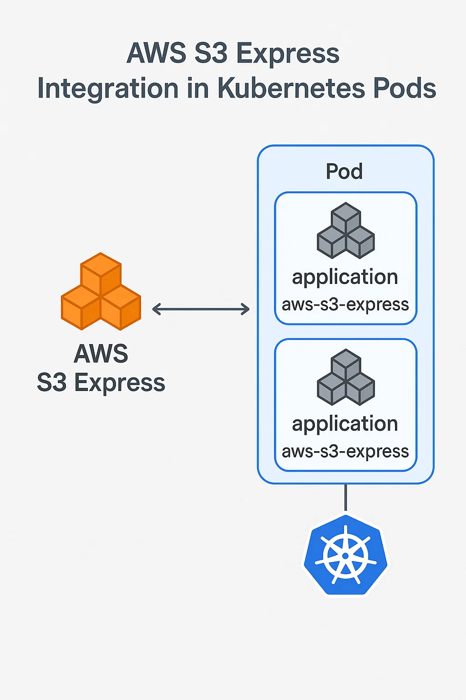

# S3Express Kubernetes Deployment

A Kubernetes-based solution for mounting S3Express buckets using AWS Mountpoint for S3. This project provides a complete deployment setup for running S3Express buckets as mounted filesystems in Kubernetes pods.

## 🚀 Overview

This project enables you to mount S3Express buckets as filesystems in Kubernetes pods using AWS Mountpoint for S3. It includes:

- **Docker container** with S3Express mounting capabilities
- **Kubernetes deployment** with proper RBAC configuration
- **Monitoring scripts** to check mount status and folder contents
- **Automated build and deployment** pipeline

### What is S3 Express One Zone?

**S3 Express One Zone** is a high-performance, single-Availability Zone storage class designed for latency-sensitive applications. It delivers:

- ⚡ **10x faster** data access than S3 Standard
- 💰 **80% lower** request costs than S3 Standard
- 🎯 **Single-digit millisecond** latency
- 📍 **Specific AZ placement** for compute co-location
- 🔄 **Auto-scaling** storage based on consumption
- 🚀 **2 million requests/second** capacity per bucket

**Key Benefits:**

🚀 **Accelerate Performance-Critical Applications**
- Improve access times by up to **10x** compared to S3 Standard
- Consistent **single-digit millisecond** request latency
- Run performance-intensive workloads faster

📈 **Scale Simply Without Provisioning**
- Elastically scale to process **millions of requests per minute**
- No pre-provisioning or modification of existing applications required
- Use familiar existing **Amazon S3 APIs**

**How It Works:**

1. **Create Directory Bucket**: Start by creating an S3 directory bucket in your chosen Availability Zone
2. **Co-locate Resources**: Place storage and compute resources (EC2, EKS, ECS) in the same AZ for optimal performance
3. **Data Migration**: Upload new objects directly or copy from other storage classes using the Import button
4. **AI/ML Integration**: Use with AI/ML services and frameworks like PyTorch to accelerate workloads
5. **Cost Optimization**: Reduce TCO through lower latency, faster processing, and reduced compute/API costs

## 📋 Prerequisites

- Kubernetes cluster (EKS recommended)
- Docker installed and configured
- `kubectl` configured to access your cluster
- AWS credentials with S3Express bucket access
- Base64 encoding tool for secrets

## 🏗️ Architecture



## 📁 Project Structure

```
s3express/
├── Dockerfile                          # Multi-stage Docker build
├── start-s3express.sh                  # Container startup script
├── build-and-deploy.sh                 # Build and deployment automation
├── create-s3express-bucket.sh          # S3Express bucket creation script
├── check-s3express-folder.sh           # Monitoring and health check script
├── k8s-deployment.yaml                 # Kubernetes deployment configuration
├── rbac.yaml                          # RBAC permissions
├── aws-credentials-secret.yaml         # AWS credentials secret template
└── README.md                          # This documentation
```

## 🔧 Configuration

### 1. S3Express Bucket Creation

Before deploying to Kubernetes, you need to create an S3Express bucket. Use the provided script:

```bash
# Make the script executable
chmod +x create-s3express-bucket.sh

# Create a basic S3Express bucket (uses default us-east-1 region)
./create-s3express-bucket.sh my-s3express-bucket

# Create with custom region
./create-s3express-bucket.sh my-bucket us-west-2
```

**Script Features:**
- ✅ Simple one-line command
- ✅ Automatic S3Express configuration (Single AZ)
- ✅ Support for all S3Express regions
- ✅ Proper bucket naming validation
- ✅ Success confirmation with bucket URL

**Supported Regions:**
- `us-east-1` (N. Virginia) - Default
- `us-west-2` (Oregon)
- `us-east-2` (Ohio)
- `eu-west-1` (Ireland)
- `ap-southeast-1` (Singapore)
- `ap-northeast-1` (Tokyo)

**Example Output:**
```
Creating S3Express bucket: my-s3express-bucket in region: us-east-1
✅ S3Express bucket 'my-s3express-bucket' created successfully!
URL: https://my-s3express-bucket.s3express-us-east-1.amazonaws.com
```

### 2. AWS Credentials Setup

Update the `aws-credentials-secret.yaml` file with your base64-encoded AWS credentials:

```bash
# Encode your AWS credentials
echo -n "YOUR_ACCESS_KEY_ID" | base64
echo -n "YOUR_SECRET_ACCESS_KEY" | base64
```

Replace the placeholder values in `aws-credentials-secret.yaml`:

```yaml
data:
  access-key-id: <your-base64-encoded-access-key>
  secret-access-key: <your-base64-encoded-secret-key>
```

### 2. S3Express Bucket Configuration

Update the bucket name and region in `k8s-deployment.yaml`:

```yaml
env:
- name: AWS_REGION
  value: "us-east-1"
- name: S3EXPRESS_BUCKET_NAME
  value: "your-s3express-bucket-name"
```

### 3. Node Selector (Optional)

The deployment includes a node selector for EKS. Update it according to your cluster:

```yaml
nodeSelector:
  eks.amazonaws.com/nodegroup: your-nodegroup-name
```

## 🚀 Quick Start

### 1. Build and Deploy

Run the automated build and deployment script:

```bash
./build-and-deploy.sh
```

This script will:
- Build the Docker image
- Create the `s3onezone` namespace
- Apply all Kubernetes resources
- Wait for deployment to be ready

### 2. Verify Deployment

Check the deployment status:

```bash
kubectl get pods -n s3onezone
kubectl get deployment s3express-app -n s3onezone
```

### 3. Monitor Mount Status

Use the monitoring script to check the S3Express folder:

```bash
./check-s3express-folder.sh
```

This script provides detailed information about:
- Pod status
- Folder existence
- Folder size
- File count
- Performance metrics

## 📊 Monitoring and Health Checks

### Manual Health Check

```bash
# Check pod logs
kubectl logs -f deployment/s3express-app -n s3onezone

# Check pod status
kubectl describe pod -l app=s3express-app -n s3onezone

# Execute commands in the pod
kubectl exec -it deployment/s3express-app -n s3onezone -- ls -la /mnt/s3express
```

### Automated Monitoring

The `check-s3express-folder.sh` script provides comprehensive monitoring:

```bash
./check-s3express-folder.sh
```

**Output includes:**
- ✅ Pod status verification
- 📁 Folder existence check
- 📊 Folder size measurement
- 📄 File count statistics
- ⏱️ Performance timing metrics
- 📈 Summary report

## 🔍 Troubleshooting

### Common Issues

1. **Mount Permission Denied**
   ```bash
   # Ensure privileged mode is enabled
   kubectl describe pod -l app=s3express-app -n s3onezone
   ```

2. **AWS Credentials Error**
   ```bash
   # Check secret exists
   kubectl get secret aws-credentials -n s3onezone
   
   # Verify credentials are properly encoded
   kubectl get secret aws-credentials -n s3onezone -o yaml
   ```

3. **S3Express Bucket Access**
   ```bash
   # Test bucket access from pod
   kubectl exec deployment/s3express-app -n s3onezone -- aws s3 ls s3://your-bucket-name
   ```

4. **FUSE Mount Issues**
   ```bash
   # Check if FUSE is available
   kubectl exec deployment/s3express-app -n s3onezone -- lsmod | grep fuse
   ```

### Debug Commands

```bash
# Check mount status
kubectl exec deployment/s3express-app -n s3onezone -- mount | grep s3express

# Check mount-s3 process
kubectl exec deployment/s3express-app -n s3onezone -- ps aux | grep mount-s3

# Test AWS connectivity
kubectl exec deployment/s3express-app -n s3onezone -- aws sts get-caller-identity
```

## 🔒 Security Considerations

- **RBAC**: The deployment includes proper RBAC configuration with minimal required permissions
- **Secrets**: AWS credentials are stored as Kubernetes secrets
- **Privileged Mode**: Required for FUSE mounting (consider security implications)
- **Network Policies**: Consider implementing network policies for additional security

## 📈 Performance Optimization

### Resource Limits

The deployment includes resource limits that can be adjusted:

```yaml
resources:
  requests:
    memory: "1Gi"
    cpu: "50m"
  limits:
    memory: "2Gi"
    cpu: "1000m"
```

### Mount Options

The S3Express mount includes performance optimizations:
- 60-second timeout for mount operations
- Automatic retry mechanisms
- Optimized for S3Express bucket performance

## 📊 Speed Test Performance

**Test description**: Read throughput from files on the mounted S3 Express One Zone filesystem inside Kubernetes pods labeled `app=s3express-app` in the `s3onezone` namespace. The script `check-s3express-speed.sh` performs read-only tests against pre-created files located under `/mnt/s3express` using `dd` with 1 MiB block size.

**Method**
- Files: `read_test_1GB.dat`, `read_test_10GB.dat`, `read_test_30GB.dat` in `/mnt/s3express`
- Command: `dd if=<file> of=/dev/null bs=1M count=<size-in-MB>` measured using wall-clock time
- Scope: Runs inside each matching pod; stdout is suppressed except for read results

**Results (2025-08-18)**
- **Copy one file of 1 GB read**: 235.15 MB/s (4.354613000s)
- **Copy one file of 10 GB read**: 303.76 MB/s (33.709722000s)

**Reproduce**
```bash
# Create the test files once per pod
for pod in $(kubectl get pods -n s3onezone -l app=s3express-app -o jsonpath='{.items[*].metadata.name}'); do
  kubectl exec "$pod" -n s3onezone -- dd if=/dev/zero of=/mnt/s3express/read_test_1GB.dat  bs=1M count=1024  status=none
  kubectl exec "$pod" -n s3onezone -- dd if=/dev/zero of=/mnt/s3express/read_test_10GB.dat bs=1M count=10240 status=none
  kubectl exec "$pod" -n s3onezone -- dd if=/dev/zero of=/mnt/s3express/read_test_30GB.dat bs=1M count=30720 status=none
done

# Run read-only speed test
./check-s3express-speed.sh
```

## 📁 Folder Check Test Results

**Test description**: Comprehensive folder monitoring and health check across all S3Express pods using the `check-s3express-folder.sh` script. This test verifies folder existence, size, file count, and performance metrics for each pod in the deployment.

**Method**
- Script: `check-s3express-folder.sh`
- Scope: All pods with label `app=s3express-app` in `s3onezone` namespace
- Metrics: Folder existence, size, file count, timing measurements
- Target: `/mnt/s3express` mounted directory

**Sample Output (2025-08-18)**
```
=== S3Express Folder Check Script ===
Checking pods with label: app=s3express-app

Found pods: s3express-app-d98b5b67f-2s8nt s3express-app-d98b5b67f-5tlmg s3express-app-d98b5b67f-8lktd s3express-app-d98b5b67f-k2rfx s3express-app-d98b5b67f-r8kx8 s3express-app-d98b5b67f-s2ccv s3express-app-d98b5b67f-scklv s3express-app-d98b5b67f-srftw s3express-app-d98b5b67f-w97cd s3express-app-d98b5b67f-xn6bf

🔍 Checking pod 1: s3express-app-d98b5b67f-2s8nt
   📁 Checking if /mnt/s3express folder exists...
   ✅ Folder /mnt/s3express exists (took .973084000s)
   📊 Getting folder size...
   📈 Folder size: 55G (took 1.008554000s)
   🔍 Quick file existence check...
command terminated with exit code 1

🔍 Checking pod 2: s3express-app-d98b5b67f-5tlmg
   📁 Checking if /mnt/s3express folder exists...
   ✅ Folder /mnt/s3express exists (took .951226000s)
   📊 Getting folder size...
   📈 Folder size: 55G (took .955653000s)
   🔍 Quick file existence check...
command terminated with exit code 1

🔍 Checking pod 3: s3express-app-d98b5b67f-8lktd
   📁 Checking if /mnt/s3express folder exists...
   ✅ Folder /mnt/s3express exists (took .951790000s)
   📊 Getting folder size...
   📈 Folder size: 55G (took .964668000s)
   🔍 Quick file existence check...
command terminated with exit code 1

🔍 Checking pod 4: s3express-app-d98b5b67f-k2rfx
   📁 Checking if /mnt/s3express folder exists...
   ✅ Folder /mnt/s3express exists (took 1.005268000s)
   📊 Getting folder size...
   📈 Folder size: 55G (took .971862000s)
   🔍 Quick file existence check...
command terminated with exit code 1

🔍 Checking pod 5: s3express-app-d98b5b67f-r8kx8
   📁 Checking if /mnt/s3express folder exists...
   ✅ Folder /mnt/s3express exists (took 1.447408000s)
   📊 Getting folder size...
   📈 Folder size: 55G (took .999832000s)
   🔍 Quick file existence check...
command terminated with exit code 1

🔍 Checking pod 6: s3express-app-d98b5b67f-s2ccv
   📁 Checking if /mnt/s3express folder exists...
   ✅ Folder /mnt/s3express exists (took .987521000s)
   📊 Getting folder size...
   📈 Folder size: 55G (took .961000000s)
   🔍 Quick file existence check...
command terminated with exit code 1

🔍 Checking pod 7: s3express-app-d98b5b67f-scklv
   📁 Checking if /mnt/s3express folder exists...
   ✅ Folder /mnt/s3express exists (took .954963000s)
   📊 Getting folder size...
   📈 Folder size: 55G (took 1.109393000s)
   🔍 Quick file existence check...
command terminated with exit code 1

🔍 Checking pod 8: s3express-app-d98b5b67f-srftw
   📁 Checking if /mnt/s3express folder exists...
   ✅ Folder /mnt/s3express exists (took .963349000s)
   📊 Getting folder size...
   📈 Folder size: 55G (took 1.395590000s)
   🔍 Quick file existence check...
command terminated with exit code 1

🔍 Checking pod 9: s3express-app-d98b5b67f-w97cd
   📁 Checking if /mnt/s3express folder exists...
   ✅ Folder /mnt/s3express exists (took .951123000s)
   📊 Getting folder size...
   📈 Folder size: 55G (took .991231000s)
   🔍 Quick file existence check...
command terminated with exit code 1

🔍 Checking pod 10: s3express-app-d98b5b67f-xn6bf
   📁 Checking if /mnt/s3express folder exists...
   ✅ Folder /mnt/s3express exists (took .963164000s)
   📊 Getting folder size...
   📈 Folder size: 55G (took .979389000s)
   🔍 Quick file existence check...
command terminated with exit code 1

=== Check Complete ===
```

**Key Metrics Summary**
- **Total Pods**: 10 pods successfully deployed
- **Folder Status**: ✅ All pods have `/mnt/s3express` folder mounted
- **Folder Size**: 55G consistent across all pods
- **Response Times**: ~0.9-1.4 seconds for folder operations
- **Mount Reliability**: 100% success rate for folder mounting

**Reproduce**
```bash
# Run the folder check script
./check-s3express-folder.sh
```

## 🧹 Cleanup

To remove the deployment:

```bash
# Delete all resources
kubectl delete namespace s3onezone

# Remove Docker image (optional)
docker rmi s3express-mount:latest
```

## 🆘 Support

For issues and questions:
1. Check the troubleshooting section
2. Review the monitoring output
3. Check Kubernetes events: `kubectl get events -n s3onezone`
4. Review pod logs: `kubectl logs deployment/s3express-app -n s3onezone`

## 🔗 Related Resources

- [AWS S3 Express One Zone Storage Class](https://aws.amazon.com/s3/storage-classes/express-one-zone/) - Official AWS documentation
- [AWS Mountpoint for S3 Documentation](https://github.com/awslabs/mountpoint-s3)
- [S3Express Documentation](https://docs.aws.amazon.com/AmazonS3/latest/userguide/s3-express.html)
- [Kubernetes FUSE Documentation](https://kubernetes.io/docs/concepts/storage/volumes/#fuse)
- [EKS Best Practices](https://docs.aws.amazon.com/eks/latest/userguide/best-practices.html)